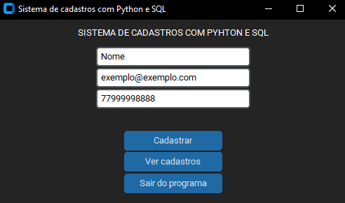
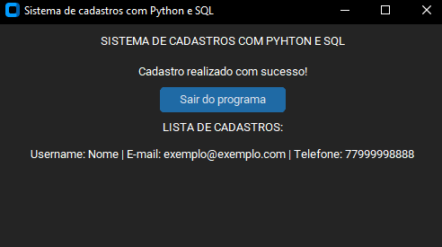

<h1 align="center">
 Sistema de cadastros com Python e SQL
 
 
</h1>

[Repositório do GitHub](https://github.com/menezesalexandre-development/sistema_de_cadastros_sql_python)

Sistema de cadastros desenvolvido com a linguagem Python, para criar a interface(Custom TkInter) e a lógica por trás do sistema, utilizando a biblioteca sqlite3 para fazer a comunicação entre o programa em Python e o Banco de Dados, disponível em um arquivo de base da dados, permitindo criar registros, tabelas, bases de dados e fazer consultas dentro do próprio Python.

 

